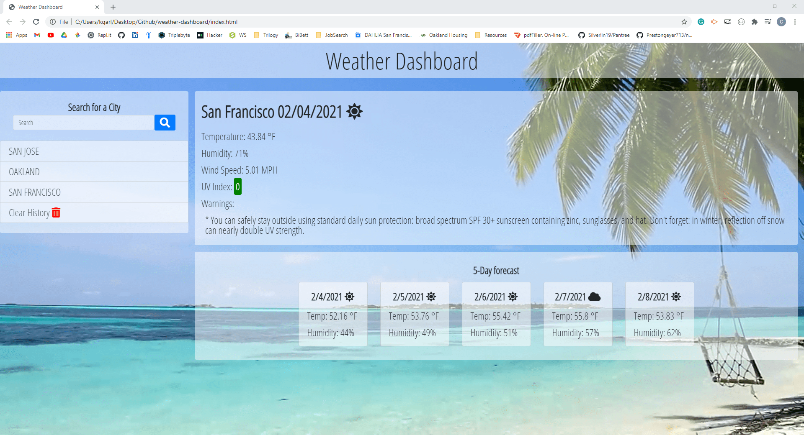

# Weather Dashboard 🌩️

</br>
<p align="center">
    
    
    
       
       
      
      
      
</p>


## Description

This application allows to type in a city and get the current weather and a 5 day forecast of this city. This application keeps a list of previously searched cities for convinience.

## Table of Contents

* [Installation](#installation)
* [Usage](#usage)
    * [Screenshots](#screenshots)
    * [Snippets](#snippets)
* [Credits](#credits)
* [License](#license)


## Installation

This application is compatible with the most commonly used web browsers.

<p align="center">
    <a href="https://kqarlos.github.io/weather-dashboard"></a>
</p>

## Usage

### Screenshots

- Live


- After a couple of inputs 




- Upon exiting and coming back to the page search history remains


- Clicking in one of the recorded history buttons gives the same result as searching for the city again


### Snippets


1. queryForecast();

This functions will query the Open Weather Forecast API. This query was special because it returned an object with 40 different weather forecasts based on day and hour. To get the information I need I had to transverse the response I got from the query and look up where in the results array it switched to a new day. This explains the _if/else_ statements. These, then, had to then be mapped to their corresponding card numbers. Once this was done it would call _addCard()_ to dynamically create the forecast card with the query information.

```javascript

function queryForecast(location) {

    //query building...
    var APIKey = "e42ce6fff3cc019aac43965299686295";
    var queryURL = "https://api.openweathermap.org/data/2.5/forecast?q=" + location + "&units=imperial&appid=" + APIKey;

    $.ajax({
        url: queryURL,
        method: "GET"
    }).then(function (response) {
        // console.log(queryURL);
        // console.log(response);
        var forecast = response.list;
        for (var i = 0; i < forecast.length; i++) {
            var cardNumber = 0;
            if (i === 0)
                cardNumber = 0;
            if (i === 6)
                cardNumber = 1;
            if (i === 14)
                cardNumber = 2;
            if (i === 22)
                cardNumber = 3;
            if (i === 30)
                cardNumber = 4;

            if (i === 0 || i === 6 || i === 14 || i === 22 || i === 30) {
                var date = forecast[i].dt_txt;
                var temperature = forecast[i].main.temp;
                var humidity = forecast[i].main.humidity;
                addCard(cardNumber, date, temperature, humidity);
            }
        }
    });
}
    
```


2. addCard();

This function will dynamically generate a card with the provided information. I use jQuery to create the _div_ the will contain the card and the different elements that will go inside the card like _p_ and _h5_. Using jQuery I use functions like _addClass()_ to add one or more classes, _text()_ to insert text tot eh element and _append()_ to bring all the element toguether into one card. This card is the added to an element in the _index.html_ file after being empties with the _empty()_ function.

```javascript

function addCard(index, date, temperature, humidity) {
    var card = $("<div>");
    card.addClass("card");
    card.addClass("bg-primary text-white");

    var cardBody = $("<div>");
    cardBody.addClass("card-body");

    var title = $("<h5>");
    title.addClass("card-title font-weight-bold");
    date = formatDate(date);
    title.text(date);

    var t = $("<p>");
    t.addClass("card-text");
    t.text("Temp: ");
    t.append(temperature);
    t.append(" °F");

    var h = $("<p>");
    h.addClass("card-text pt-3");
    h.text("Humidity: ");
    h.append(humidity);
    h.append("%");

    cardBody.append(title);
    cardBody.append(t);
    cardBody.append(h);
    card.append(cardBody);

    $("#" + index).empty();
    $("#" + index).append(card);
}

```

## Credits 

### Author

- 💼 Carlos Toledo: [portfolio](https://professional-portfolio2020.herokuapp.com/)
- :octocat: Github: [kqarlos](https://www.github.com/kqarlos)
- LinkedIn: [carlos-toledo415](https://www.linkedin.com/in/carlos-toledo415/)


### Built With
    
<p align="center">
    <a href="https://developer.mozilla.org/en-US/docs/Web/HTML"></a>
    <a href="https://developer.mozilla.org/en-US/docs/Web/CSS"></a>
    <a href="https://www.javascript.com/"></a>
    <a href="https://getbootstrap.com/"></a>
    <a href="https://momentjs.com/docs/"></a>
    <a href="https://openweathermap.org/api"></a>
    <a href="https://jquery.com/"></a>
</p>
</br>

## License

<p align="center">
    
</p>